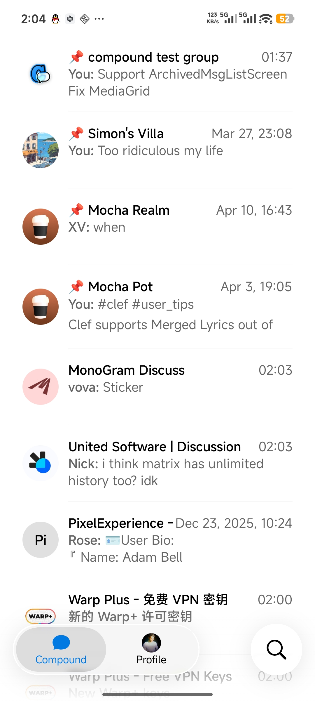
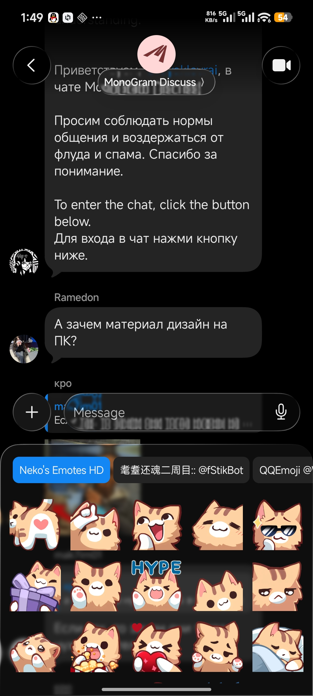
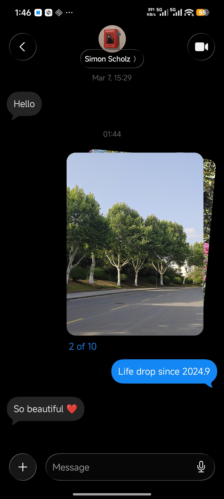
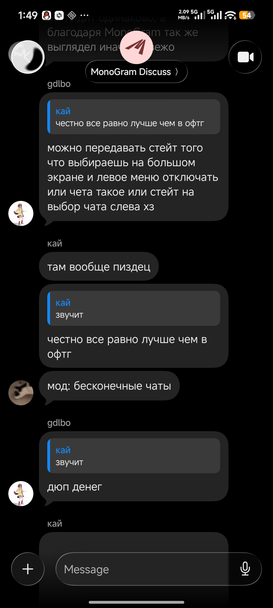
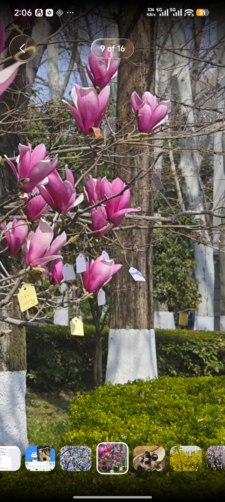

# Compound

<a href="https://github.com/6xingyv/compound/stargazers">
    
</a>

<a href="#️-license">
    
</a>
<a href="https://t.me/+RXZSTJ7ojVAwYjY1">
    
</a>

A beautiful Telegram messaging app, for Android.

> [!IMPORTANT]
> Compound is currently in active de development. You might meet frequent testflight, unexpected error.

## 👓 Preview

<table>
    <tr>
        <td></td>
        <td></td>
        <td></td>
        <td></td>
    </tr>
    <tr>
        <td></td>
    </tr>
</table>

## ✨ Features

* **Beautiful UI:** Built with Jetpack Compose. Cupertino design.
* **Fully i18ned:** Synced with official Telegram translation.
* **Exclusive features:**
  * Smart person name formatting (eg: 哲睿 张 -> 张哲睿, Simon Scholz -> Simon Scholz)
  * Stacked photo in chat
  * Share source display for apps supporting Compound Share Protocol

## ⚖️ License

This project is licensed under **CC BY-ND 4.0**.

* **Allowed:** Cloning and forking for personal use or submitting **Pull Requests**. We love contributions!
* **Prohibited:** Distributing modified versions (forks) or re-packaged APKs.

> **Note to Contributors:** To prevent ecosystem fragmentation and ensure security, all improvements must be submitted via PR to the official repository. Publicly hosting a modified fork is not permitted.

## 📦 Build

1. **Clone the repository**:

    ```bash
    git clone https://github.com/6xingyv/compound.git
    ```

2. **Setup configs**:

   Before building the project, you must configure your environment. Create a local.properties file in the root directory and add the following:

   ```properties
   # Telegram API ID and Hash
   API_ID=YOUR_API_ID
   API_HASH=YOUR_API_HASH
   # Signing Config
   RELEASE_STORE_FILE=/Users/yourname/keys/my-release-key.jks
   RELEASE_STORE_PASSWORD=your_password
   RELEASE_KEY_ALIAS=your_alias
   RELEASE_KEY_PASSWORD=your_password
   ```

   Where the **Telegram API ID and Hash** can be obtained from <https://my.telegram.org>.

3. **Build**
    Use the following Gradle command to build a debug APK:

    ```bash
    ./gradlew app:assembleDebug
    ```

## 💻 Developing

### Tech Stack

Compound is built with modern Android development standards:

* **Language**: Kotlin (with C++ JNI for TDLib)
* **UI Framework**: Jetpack Compose
* **Visual Effects**: [Gaze Glassy](https://github.com/6xingyv/gaze-glassy)
* **Architecture**: Clean Architecture + Unidirectional Data Flow (MVI)
* **Core Engine**: TDLib
* **Dependency Injection**: Koin
* **Media**: Media3 & Coil & `VpxPlayer`(for webm stickers)
* **i18n**: `tci18n` (KSP-powered localized string system)

For more detailed information on our architecture and how to get started with development, please read our [Developer Guide](AGENTS.md).

## 🤝 Contributing

We welcome contributions that align with the project's vision!

1. Open an issue to discuss the change.
2. Submit a Pull Request.
3. Once merged, your changes will be part of the official distribution.

---

*Disclaimer: This project is not officially affiliated with Telegram Messenger LLP.*
